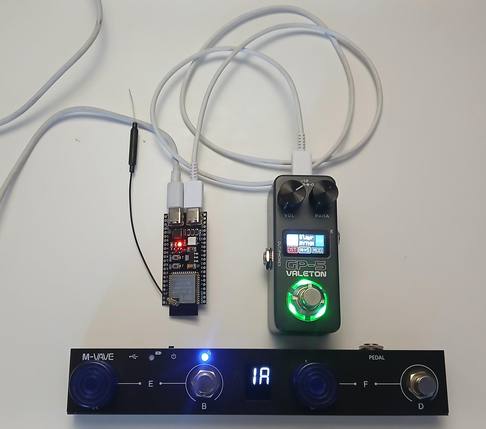
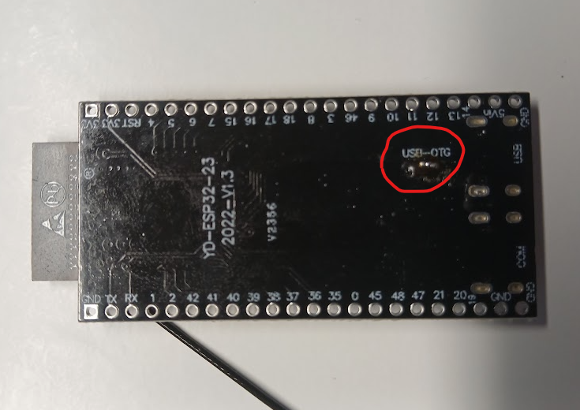
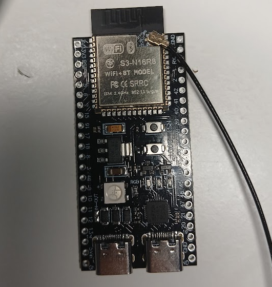

# Valeton GP-5 WIDI Bridge

## Overview
This project implements a WIDI (Wireless MIDI) bridge for the Valeton GP-5 guitar processor, enabling wireless MIDI communication. 

## Features
- Wireless MIDI connectivity for Valeton GP-5
- Arduino-based implementation
- Translates Program Change MIDI messages to Control Change (CC #0) messages required by the GP-5 for preset switching

## Hardware Requirements
- ESP32 board with integrated USB-OTG and BLE like ESP32-S3
- Valeton GP-5 guitar processor
- BLE footswitch like M-Vave Chocolate
- Some USB-C cables
- you need to soldier the USB-OTG pads to power the GP-5 from the ESP32 board   

## Installation
1. Clone this repository
2. Open the project in Arduino IDE
3. Open Board Manager and install esp32 by Espressif Systems
4. Open Library Manager and install required libraries
    - NimBLE-Arduino by h2zero (install version 1.4.3)
    - ESP32-BLE-MIDI by Maxime ANDRÉ
5. Replace the original libusb.a in the esp32 package with the library provided in the project. The path to the esp32 package should be something like: "C:\Users\<your_user_folder>\AppData\Local\Arduino15\packages\esp32\tools\esp32-arduino-libs\idf-release_v5.5-f1a1df9b-v3\esp32s3\lib"
6. Upload to your ESP32 board

## Usage
1. Power on the ESP32 WIDI module
2. Connect the USB-OTG port of the ESP32 to the GP-5
3. Power on the M-Vave Chocolate footswitch and it should automatically pair with the ESP32 board (make sure other devices that Chocolate was paired with before are switched off)

## Additional Information
The default compilation options of the USB host component in the official Arduino esp32 core by Espressif Systems, does not work with Valeton GP-5, unfortunatelly. The libusb.a library provided in this repository is compiled from the esp-idf release/v5.5 branch with the following options:
- CONFIG_USB_HOST_CONTROL_TRANSFER_MAX_SIZE = 4096
- CONFIG_USB_HOST_DEBOUNCE_DELAY_MS = 500
- CONFIG_USB_HOST_RESET_HOLD_MS = 50
- CONFIG_USB_HOST_RESET_RECOVERY_MS = 50
- CONFIG_USB_HOST_SET_ADDR_RECOVERY_MS = 20

You may find this information usefull in case you need to recompile the libusb.a in future releases of esp-idf and esp32 Arduino core.

## License
Do whatever you need with this code
